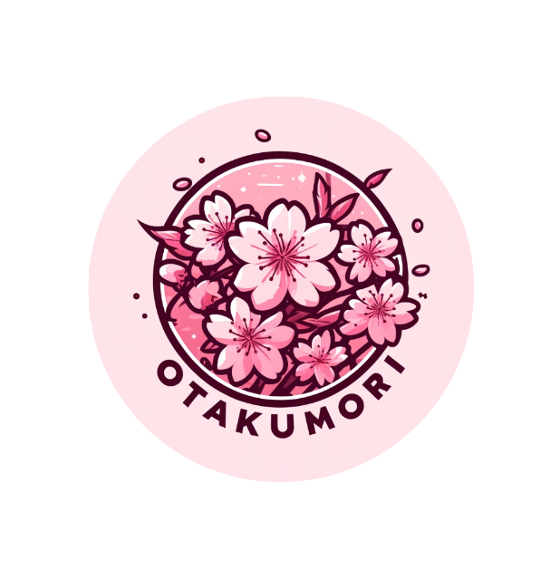

<div align="center">
  

  <h1>Otaku-Mori</h1>

  <p><strong>A dark storybook anime-commerce world where petals, relics, games, and identity systems bloom together.</strong></p>

  <p>
    <em>charcoal paper · muted sakura · ivory type · ornamental commerce · playable identity</em>
  </p>

  <p>
    <a href="https://www.otaku-mori.com">Live Site</a>
    ·
    <a href="https://github.com/Otakumori/Otakumori/issues/33">Avatar Visual Contract</a>
    ·
    <a href="docs/testing/baseline-stabilization.md">Baseline Stabilization</a>
  </p>
</div>

---

## The World

Otaku-Mori is not a generic storefront.

It is a quiet, dark, sakura-lit system for shopping, playing, collecting, and building identity. The intended feeling is closer to an old game menu, a shrine catalog, and a hand-inked relic shop than a modern SaaS dashboard.

The visual direction is built around charcoal texture, muted blossom pink, warm ivory typography, thin ornamental frames, time-of-day backgrounds, and clickable petals that feel soft rather than loud.

> A timeless descent.

---

## Current Build Direction

<table>
  <tr>
    <td><strong>Visual language</strong></td>
    <td>Dark storybook commerce, antique linework, sakura accents, framed inventory cards.</td>
  </tr>
  <tr>
    <td><strong>Commerce</strong></td>
    <td>Internal shop and checkout surfaces with guarded provider-backed fulfillment.</td>
  </tr>
  <tr>
    <td><strong>Identity</strong></td>
    <td>Profiles, petals, titles, achievements, inventory, avatars, and future insider systems.</td>
  </tr>
  <tr>
    <td><strong>Play layer</strong></td>
    <td>Mini-games, petal rewards, avatar presence, and route-owned gameplay surfaces.</td>
  </tr>
  <tr>
    <td><strong>Readiness posture</strong></td>
    <td>Security gates hardened, diagnostics stabilized, remaining debt documented and PR-scoped.</td>
  </tr>
</table>

---

## Core Systems

### Commerce

Otaku-Mori uses a protected commerce architecture with internal shop surfaces and provider-backed fulfillment controls.

Current commerce concerns include:

- public catalog and product routes
- cart and checkout flows
- Stripe payment handling
- Printify fulfillment integration
- provider-write authorization guards
- static commerce release checks
- production-critical dependency audit gates

Provider routes and payment behavior are intentionally isolated. Public shop surfaces should never depend on sensitive diagnostics or provider-write paths.

### Petals

Petals are the reward layer of the site. They connect homepage interaction, mini-games, progression, and future digital rewards.

Petal grants must remain server-owned and validated. Client-side reward claims should never become authority.

### Mini-Games

Mini-games are part of the site’s identity loop, not throwaway extras. They support reward progression, avatar presence, and future profile expression.

Known avatar integration follow-up games:

| Game | Expected avatar mode | Direction |
| --- | --- | --- |
| `petal-samurai` | `fullBody` | Sword-bearing side presence that never blocks slicing gameplay. |
| `memory-match` | `portrait` | Framed player token or profile medallion. |
| `bubble-girl` | `chibi` | Playful sandbox companion. |
| `blossomware` | `chibi` | Compact microgame identity. |
| `dungeon-of-desire` | `bust` | Moody dungeon-party portrait. |
| `thigh-coliseum` | `fullBody` | Stylized full-body combatant presence. |

### Avatars

The avatar system should feel native to the Mori world: shrine-doll, paper-doll, occult companion, or playable familiar.

It should not feel like a generic 3D mannequin, Bitmoji clone, Roblox avatar, or glossy mobile-game mascot.

Expected display modes:

- `fullBody`
- `bust`
- `portrait`
- `chibi`

The avatar visual contract is tracked in [issue #33](https://github.com/Otakumori/Otakumori/issues/33).

---

## Stack

<table>
  <tr>
    <td><strong>Framework</strong></td>
    <td>Next.js App Router</td>
  </tr>
  <tr>
    <td><strong>Language</strong></td>
    <td>TypeScript</td>
  </tr>
  <tr>
    <td><strong>Styling</strong></td>
    <td>Tailwind CSS</td>
  </tr>
  <tr>
    <td><strong>Auth</strong></td>
    <td>Clerk</td>
  </tr>
  <tr>
    <td><strong>Data</strong></td>
    <td>Prisma + PostgreSQL / Neon</td>
  </tr>
  <tr>
    <td><strong>Payments</strong></td>
    <td>Stripe</td>
  </tr>
  <tr>
    <td><strong>Fulfillment</strong></td>
    <td>Printify</td>
  </tr>
  <tr>
    <td><strong>Hosting</strong></td>
    <td>Vercel</td>
  </tr>
  <tr>
    <td><strong>Quality</strong></td>
    <td>Vitest, Playwright, static commerce checks, advisory Lighthouse/accessibility lanes</td>
  </tr>
</table>

Package manager:

```bash
pnpm
```

Node target:

```bash
20.20.2
```

---

## Local Development

Install dependencies:

```bash
pnpm install
```

Generate Prisma client:

```bash
pnpm prisma:generate
```

Start the dev server:

```bash
pnpm dev
```

Run core checks:

```bash
pnpm typecheck
pnpm lint
node scripts/commerce-release-static-checks.mjs
pnpm audit --prod --audit-level critical
```

Run tests:

```bash
pnpm test
pnpm mini-games:qa
pnpm test:e2e
```

Build locally:

```bash
pnpm vercel-build
```

---

## Quality Gates

Required lanes currently focus on build stability, security containment, and commerce safety.

Required or release-critical checks include:

- TypeScript typecheck
- ESLint
- targeted containment tests
- commerce static checks
- Vercel build
- API Health Check
- production-critical dependency audit

Advisory lanes remain visible but non-blocking until stabilized:

- broad Vitest
- mini-game QA
- Playwright browser flows
- accessibility scans
- Lighthouse diagnostics

No advisory lane should become required after one green run. Promotion requires repeated stability, documented runtime requirements, and no environment-dependent false positives.

---

## Recent Stabilization

### PR #31: Provider Write Lockdown

Hardened provider-write and diagnostic surfaces, remediated production-critical advisories, preserved required CI/security gates, and avoided production/provider/payment/database actions.

### PR #32: Baseline Diagnostics and Harnesses

Reduced noisy test debt, fixed mini-game route discovery, classified browser and Lighthouse blockers cleanly, and documented remaining work in:

```text
docs/testing/baseline-stabilization.md
```

### Issue #33: Avatar Visual Contract

Defines the avatar art direction before mini-game integration work continues.

---

## Enterprise Readiness Roadmap

The next work should remain scoped and PR-driven.

Recommended order:

1. Mori storybook visual system foundation
2. Avatar visual contract documentation
3. Shared mini-game avatar adapter
4. One-game avatar proof, likely `petal-samurai`
5. Remaining mini-game avatar integrations
6. Homepage and shop visual polish
7. Middleware and CSP hardening
8. Clerk-compatible browser test harness
9. Dependency and tooling remediation

Do not combine unrelated security, payment, avatar, homepage, dependency, and middleware changes in one PR.

---

## Safety Rules

Avoid casual edits to:

- Stripe routes
- Printify/provider routes
- database schema
- migrations
- environment files
- package manager config
- lockfile
- provider-write guards
- security audit thresholds

Provider writes, payment behavior, emails, database migrations, and fulfillment actions require explicit review and isolated PRs.

---

<div align="center">
  <p><strong>Otaku-Mori</strong></p>
  <p><em>Where memories bloom, relics wait, and the petals remember you.</em></p>
</div>
